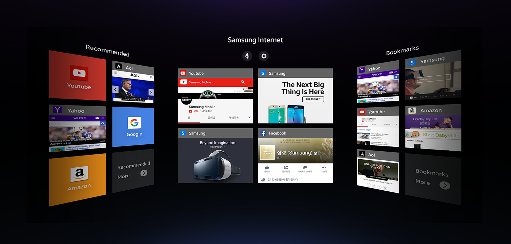
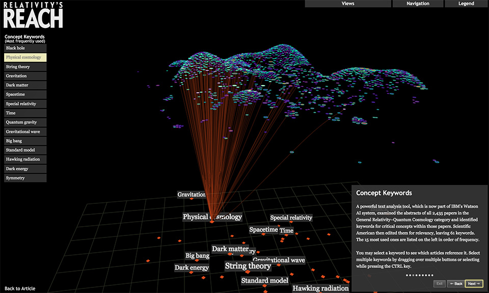
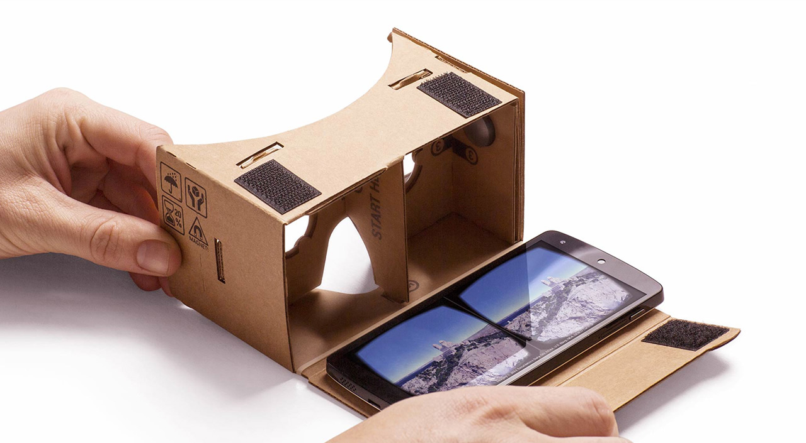
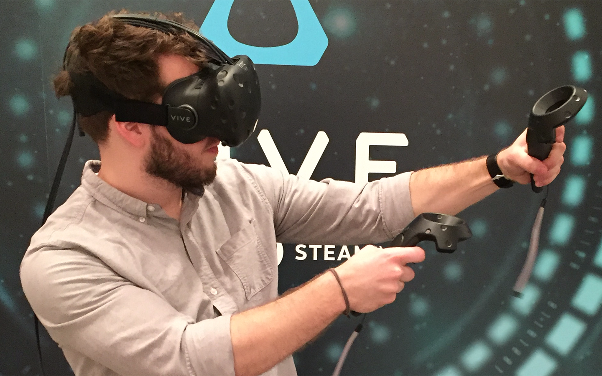
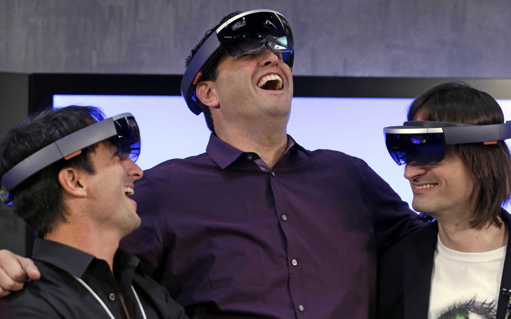

#Visualization

#and the VR Web

brian ho&ensp;//&ensp;vr research part one&ensp;//&ensp;summer fellowship 2016

2016.08.08
Note: This is the first part, second on Thursday. Want to review the technology, basic principles and WIP. Higher-level discussion on Thursday. Build on last Thursday round table on MKT+RH1, help provide insight into process of creating an online data platform.


##Why VR? Why the Web?


###Advantages, in theory
- **Speed:** runs without a separate application or procedure
- **Portability:** can be emailed, shared and navigated to by URL
- **Accessibility** cheap and easy to use
- **Depth:** conveys more information than conventional 2D interfaces
- **Familiarity:** relies on intuitive gestures and behaviors


###It is _a_ future for visualization
<iframe src="https://player.vimeo.com/video/49216050?title=0&byline=0&portrait=0" width="1280" height="720" frameborder="0" webkitallowfullscreen mozallowfullscreen allowfullscreen></iframe>

Developed in 2002 by UI designer [John Underkoffler](http://www.fastcodesign.com/3046205/7-questions-for-the-guy-who-designed-minority-reports-futuristic-uis) for the film. He's now CEO of [Obolong](http://www.oblong.com), which today sells a similar system as an actual product!


###VR and the internet, today


Clearly, there's still a long way to go. If you're curious, there's a good [FastCo.Design article](http://www.fastcodesign.com/3058591/why-a-virtual-reality-web-may-never-happen) on the subject of the VR web.


###VR and architecture, today
<iframe width="1280" height="720" src="https://www.youtube.com/embed/7Fzxu3hkuXo" frameborder="0" allowfullscreen></iframe>

Amazing work by the pioneering [IrisVR](https://www.irisvr.com) team. [Flux.io](https://labs.flux.io/flux-vr/) and [Thornton Tomasetti's CORE studio](http://core.thorntontomasetti.com/vrx/) are making similar efforts.


###VR/3D and data visualization, today


One of the better examples yet, by the incredible [Office for Creative Research](http://ocr.nyc). Is it better, however, than just laying it out in 2D?


###Prototyping the stack


###Stack what now?
<div class="flex-container">
    <div class="flex-item" style="-webkit-flex: 2; flex: 2;"> **HTML**</div>
    <div class="flex-item" style="-webkit-flex: 1; flex: 1;"><h1>+</h1></div>
    <div class="flex-item" style="-webkit-flex: 2; flex: 2;"> **CSS**</div>
    <div class="flex-item" style="-webkit-flex: 1; flex: 1;"><h1>+</h1></div>
    <div class="flex-item" style="-webkit-flex: 2; flex: 2;"> **JS**</div>
    <div class="flex-item" style="-webkit-flex: 1; flex: 1;"><h1>+</h1></div>
    <div class="flex-item" style="-webkit-flex: 2; flex: 2;"> **D3.js**</div>
    <div class="flex-item" style="-webkit-flex: 2; flex: 1;"><h1>+</h1></div>
    <div class="flex-item" style="-webkit-flex: 2; flex: 2;"> **A-Frame**</div>
    <div class="flex-item" style="-webkit-flex: 1; flex: 1;"><h1>+</h1></div>
    <div class="flex-item" style="-webkit-flex: 2; flex: 2;"> **Cardboard**</div>
</div>
<br><br>
Benjamin Bratton's [recent book](https://mitpress.mit.edu/books/stack) takes the concept to the next level.


###Google Cardboard


$10 gets you a ticket to the frontiers of the VR web.


###Alternative VR hardware
<div class="flex-container">
    <div class="flex-item" style="-webkit-flex: 2; flex: 2;"> **Oculus Rift**</div>
    <div class="flex-item" style="-webkit-flex: 2; flex: 2;"> **HTC Vive** </div>
    <div class="flex-item" style="-webkit-flex: 2; flex: 2;"> **Hololens**</div>
</div>

Available now or out soon, for about $2000-$3000. Yikes.


###HTML/CSS/JS
<div class="flex-container">
    <div class="flex-item" style="-webkit-flex: 1; flex: 1;"><span class="fragment"></span></div>
    <div class="flex-item" style="-webkit-flex: 3; flex: 3;"><span class="fragment"><br>**HTML**</span></div>
    <div class="flex-item" style="-webkit-flex: 2; flex: 2;"><h1 class="fragment">+</h1></div>
    <div class="flex-item" style="-webkit-flex: 3; flex: 3;"><span class="fragment"><br>**CSS**</span></div>
    <div class="flex-item" style="-webkit-flex: 2; flex: 2;"><h1 class="fragment">+</h1></div>
    <div class="flex-item" style="-webkit-flex: 3; flex: 3;"><span class="fragment"><br>**JS**</span></div>
    <div class="flex-item" style="-webkit-flex: 1; flex: 1;"><span class="fragment"></span></div>
</div>
<br>
The backbone of the web.


###D3.js
<iframe style="background: #FFFFFF;" width="1280" height="720" src="https://brian-ho.github.io/MKThink-strategy-tool/" frameborder="0" allowfullscreen></iframe>

A great way to bind data to anything in a web page's DOM.


###A-Frame
```html
<body>
  <a-scene>
      <a-box color="red" width="1" height="1" depth="1"></a-box>
      <a-sky color="#ECECEC"></a-sky>
  </a-scene
</body>
```

VR made really, really [easy](https://aframe.io).


###Hello, world.
<iframe width="1280" height="720" src="https://brian-ho.github.io/" frameborder="0" allowfullscreen></iframe>


##Progress so far


###Anything you can D3, I can 3D it! Almost.
<iframe style="background: #FFFFFF;" width="1280" height="720" src="https://bl.ocks.org/mbostock/raw/3808234/" frameborder="0" allowfullscreen></iframe>

[Original](https://bl.ocks.org/mbostock/3808234) by Mike Bostock, creator of D3.js. Proof of concept completed in 3D  [here](https://brian-ho.github.io/vr-04/).


###Wait, what about the VR?

Take a look at [bit.ly/bho_vr_test](https://brian-ho.github.io/vr-06/).


##Fin
Thanks for listening! Slides online at [bit.ly/bho_vr_1](http://bit.ly/bho_vr_1).
