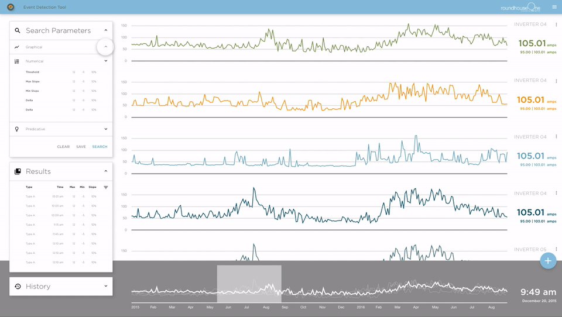
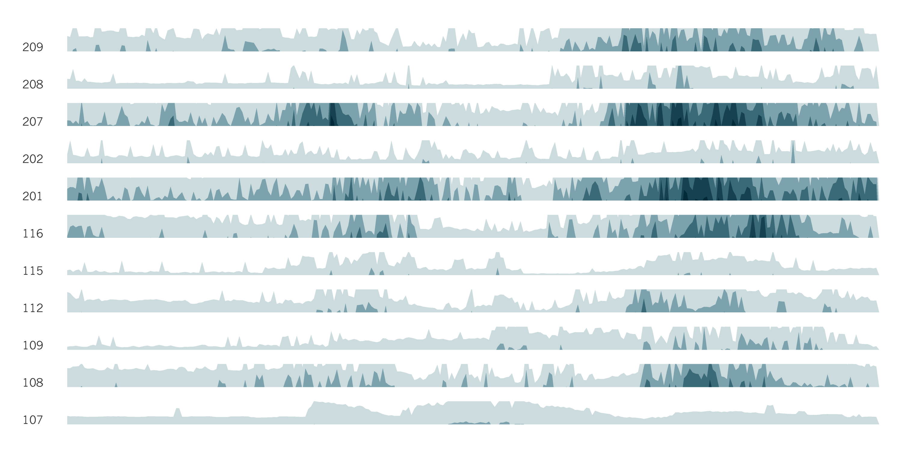

#Visualizing the Built Environment on the Virtual Reality Web

brian ho&ensp;//&ensp;vr research part one&ensp;//&ensp;mk think summer fellowship 2016

2016.08.08
Note: This is the first part, second on Thursday. Want to review the technology, basic principles and WIP. Higher-level discussion on Thursday. Build on last Thursday round table on MKT+RH1, help provide insight into process of creating an online data platform.

##Why VR?

###It is _a_ future for visualization
<iframe src="https://player.vimeo.com/video/49216050" width="640" height="360" frameborder="0" webkitallowfullscreen mozallowfullscreen allowfullscreen></iframe>

Developed in 2002 by UI designer [John Underkoffler](http://www.fastcodesign.com/3046205/7-questions-for-the-guy-who-designed-minority-reports-futuristic-uis) for the film. He's now CEO of [Obolong](http://www.oblong.com), which today sells a similar system as an actual product!

###The VR web

Clearly, there's a lot to be resolved. If you're curious, there's a good [FastCo.Design article](http://www.fastcodesign.com/3058591/why-a-virtual-reality-web-may-never-happen) on the subject.

###Prototyping the stack

###Stack what now?
Although Benjamin Bratton's [recent book](https://mitpress.mit.edu/books/stack) takes the concept to the next level.

###Google Cardboard

###Alternative VR hardware

###HTML/CSS/JS

###D3.js

###A-Frame

##Initial studies

###What's next

<h6>storage</h6>
###How can data make change?
Note: struggled to come up with how to frame. visualization doesn't work: too passive, static, quantitative. I want to  to work between the built environment + data + people. MKthink: architects, data analysts, designers, developers, engineers, planners, strategists (in no order) together. can I make things visual/manifest that unites these disciplines? so some questions.

<h6>map</h6>
###How can strategies and plans become reality?

<h6>business</h6>
###How can architecture expand its scope of practice?

<h6>update</h6>
###How can we design with/for/against the new and the next?

<h3 class='fragment'>I don't know.</h3>

<h3 class='fragment'>Instead, a presentation in three acts ....</h3>

<h3 class='fragment'>1. Interface</h3>

<h3 class='fragment'>2. Tool</h3>

<h3 class='fragment'>3. System</h3>

Note: as a framework, I've split this up into 3 parts. each will discuss both the ends and the means to that end.

<h6>devices</h6>
##1. Interface
Note: the front-end.

###User experience design for RoundhouseOne + 4daptive

An exercise in imagining an intuitive (as possible) "search" across non-spatial data.
Note: Think of google maps. Define the next "maps."

###Adobe XD

(N.B. it's currently free)

Note: Great quick prototyping tool for wireframes.

###Horizon chart

Trying to find ways to show lots of time-series data as a meaningful aggregate.
Note: Came out of RH1 work ... I didn't invent the form.

###Horizon chart, closer

You can read both the details of individual series, as well as trends across nearby series.
Note: Trends and individuals.

###Horizon chart, even closer

Preserves the resolution of information, while increasing vertical compression.

There's a [d3.js version](http://bl.ocks.org/mbostock/1483226) waiting to be made ...
Note: Make big data a little smaller.

###Rhino + Grasshopper
</img>
&emsp;&emsp;&emsp;
</img>

An imperative/algorithmic visual programming language ... for geometry!

Note: I'm a huge fan!

###What it looks like:

A mess, basically.
Note: Spaghetti monster.

###What it looks like, closer:

Data in, data out. Simple! And extensible.
Note: Each component is a little function.

<h6>build</h6>
##2. Tool
Note: making things that help make other things.

###Interactive strategy tool

Maybe interaction can help a client understand trade-offs?
Note:

###Interactive strategy tool

The color changes as the area approaches limits.

###Interactive strategy tool

3D, not so good.

###Space planning area tool

Drawing or editing polyline boundaries adjusts the chart.
Note: (flux)

###Space planning area tool

Colors are programmatic and can adjust to distinguish categories or sub-categories.
Note: (flux)

###Space planning area tool

Rhino is linked to Excel, so changes to spreadsheet labels or values adjust the chart ...
Note: (flux)

###Space planning area tool

... and vice versa.
Note: (flux)

###Flux
</img>

</img>

Puts all your data and geometry in the cloud. Free at [flux.io](flux.io)!

<h6>public</h6>
##3. System
Note: complete assemblies, broader interactions

###DepotGoGo map

Initial mapping of existing infrastructures.
Note: (galapagos, solving + learning)

###DepotGoGo map, closer

Layering information.
Note: (galapagos, solving + learning)

###GIS and APIs
</img>
&emsp;
</img>
&emsp;&emsp;
</img>

Pulling GPS coordinates from the Google Places API into Grasshopper + importing GIS shapefiles from [SF OpenData](https://data.sfgov.org).

It's an alphabet soup!

Note: (galapagos, solving + learning)

###DepotGoGo location optimizing

Evolving a solution, in a full CAD environment.
Note: (galapagos, solving + learning)

###Galapagos

Survival of the fittest! Diagrams from [David Rutten](http://www.grasshopper3d.com/profiles/blogs/evolutionary-principles).
Note: (galapagos, solving + learning)

##Fin
Thanks for listening! Slides online at [bit.ly/bho_viz_talk](http://bit.ly/bho_viz_talk).
