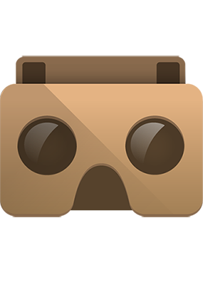

#Design and Visualization for the Virtual Reality Web

brian ho&ensp;//&ensp;vr research part one&ensp;//&ensp;mk think summer fellowship 2016

2016.08.08
Note: This is the first part, second on Thursday. Want to review the technology, basic principles and WIP. Higher-level discussion on Thursday. Build on last Thursday round table on MKT+RH1, help provide insight into process of creating an online data platform.

##Why VR? Why the Web?

###Advantages, in theory
- **Speed:** runs without a separate application or procedure
- **Portability:** is as accessible as anything else on the Internet
- **Depth:** conveys more information than conventional 2D interfaces
- **Familiarity:** relies on intuitive gestures and behaviors

###It is _a_ future for visualization
<iframe src="https://player.vimeo.com/video/49216050?title=0&byline=0&portrait=0" width="1280" height="720" frameborder="0" webkitallowfullscreen mozallowfullscreen allowfullscreen></iframe>

Developed in 2002 by UI designer [John Underkoffler](http://www.fastcodesign.com/3046205/7-questions-for-the-guy-who-designed-minority-reports-futuristic-uis) for the film. He's now CEO of [Obolong](http://www.oblong.com), which today sells a similar system as an actual product!

###The VR and the web, today

Clearly, there's still a long way to go. If you're curious, there's a good [FastCo.Design article](http://www.fastcodesign.com/3058591/why-a-virtual-reality-web-may-never-happen) on the subject of the VR web.

###VR and architecture, today
<iframe width="1280" height="720" src="https://www.youtube.com/embed/7Fzxu3hkuXo" frameborder="0" allowfullscreen></iframe>

Amazing work by the pioneering [IrisVR](https://www.irisvr.com) team. Although [Flux.io](https://labs.flux.io/flux-vr/) and [Thornton Tomasetti's CORE studio](http://core.thorntontomasetti.com/vrx/) are making similar efforts.

###3D and data visualization, today

One of the better examples yet, by the incredible [Office for Creative Research](http://ocr.nyc). Is it better, however, than just laying it out in 2D?

###Prototyping the stack

###Stack what now?
 

    
 **HTMK**

    
 **+** 

    
 **CSS**

    
 + 

    
 **JS**

    
 + 

    
 **D3.js**

    
 **+** 

    
 **A-Frame**

    
 + 

    
 **Google Cardboard**

  
Benjamin Bratton's [recent book](https://mitpress.mit.edu/books/stack) takes the concept to the next level.

###Google Cardboard

###Alternative VR hardware

###HTML/CSS/JS

###D3.js

###A-Frame

##Initial studies

###What's next

##Fin
Thanks for listening! Slides online at [bit.ly/bho_vr_1](http://bit.ly/bho_vr_1).
